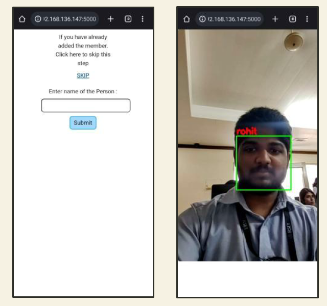
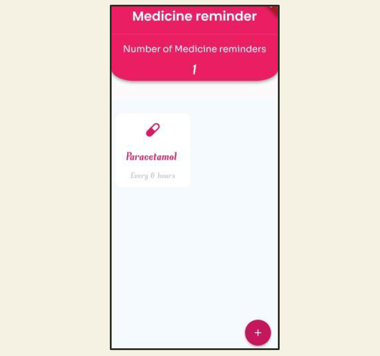
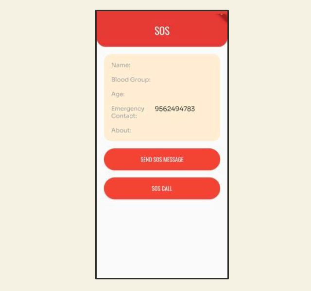
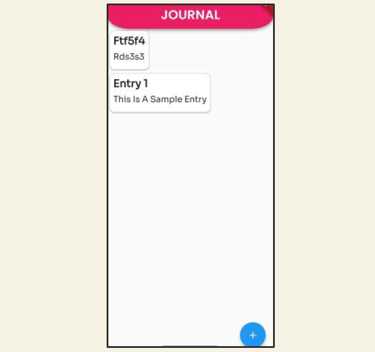
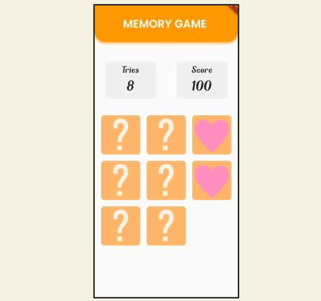
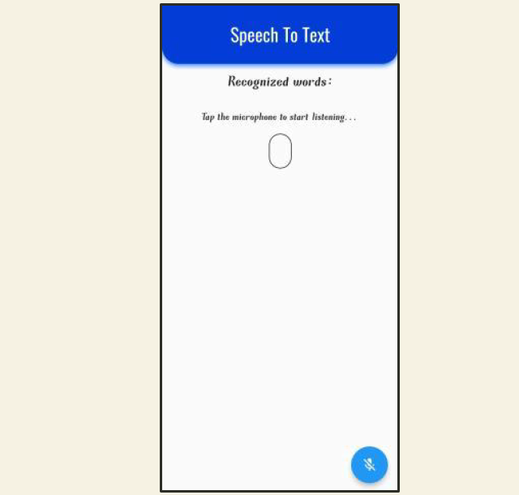

[](https://www.linkedin.com/in/riya-joseph-67314b213)

<h1 align="center">Unify-App</h1>

<p align="center">
  <a href="https://github.com/Ratheshan03/readme-typing-svg"></a>
</p>

<p align="center">
  <em>
    This is a mobile application developed to help people who have <b>geriatric</b> and <b>cognitive disabilities</b>. The app would be helpful for the senior citizens by guiding them to live close to normal life by utilizing the features of the app.
  </em>
</p>

### Features of the app

<ol>
  <li>
    <b>Face Recognition</b>: This feature is meant for patients with early stage memory disorders. First, either the patient or their caretaker has to add a new person into the model. Then when the patient views that person using the app, in real time, that person’s name and relation to the patient is displayed.
    <br>
    <br>
    <div align='center'>
      
    </div>
  </li>
  <br>
  <li>
    <b>Medicine Reminder</b>: This feature helps the patient take their medicines on time. The patient or their caretaker can add an entry for every medicine they need to take and the app will alert the patient via a notification at the appointed time.
    <br>
    <br>
    <div align='center'>
      
    </div>
  </li>
  <br>
  <li>
    <b>SOS</b>: This feature helps alert the patient’s emergency contact about their location. The patient has the option to either call or message their emergency contact. The message also contains the location coordinates of the patient that can be accessed via Google maps.
    <br>
    <br>
    <div align='center'>
      
    </div>
  </li>
  <br>
  <li>
    <b>Journal</b>: This feature helps patient note down details about objects that they would like to recall in the future. Patients with memory loss often feel more comfortable being told something by their past selves rather than someone else. Patients can add an image or audio recording along with each journal entry.
    <br>
    <br>
    <div align='center'>
      
    </div>
  </li>
  <br>
  <li>
    <b>Memory game</b>: This feature is for people suffering from memory disorders. The game consists of 8 tiles having 4 pairs of matching images. The images are randomly hidden on each tile. The aim of the game is to match two tiles that have the same images. The patient has to remember which tiles contain what image in order to successfully complete the game.
    <br>
    <br>
    <div align='center'>
      
    </div>
  </li>
  <br>
  <li>
    <b>Speech to text conversion</b>: This feature is for people suffering auditory disorders. A person can talk into the app , which converts the speech to a text form that can be read by the patient. This removes the need to talk to the patient in a loud voice.
    <br>
    <br>
    <div align='center'>
      
    </div>
  </li>
</ol>

### System Requirements

The system of user which is a `smart phone` is expected to have the following features:

```
- Android platform with a version above 4
- Internet connection (for face recognition)
- A storage space of approximate 100 MB for the app
- 2GB RAM
- SIM card with active connection (for working of SOS feature)
```

### Applications/Frameworks used
<ul>
  <li>Android Studio</li>
  <li>Jupyter Notebook</li>
  <li>Flutter</li>
</ul>

[(Back to top)](#Unify-App)
